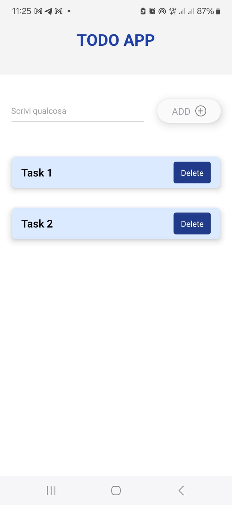

# TODO APPLICATION  

## Tecnologie utilizzate  
- **Expo**  
- **NativeBase** (UI Framework)  

---

## Avvio dell'applicazione  

1. Scaricare il file ZIP del progetto o clonare la repository.  
2. Aprire il terminale e posizionarsi nella cartella del progetto.  

   Eseguire i seguenti comandi:  
   ```bash
   npm install or yarn start
    ```
# IMPORTANTE

- Scaricare **Expo Go** sul dispositivo  *iOS* o *Android*.
- Scannerizzare il **QR Code** che appare nel terminale dopo aver eseguito il comando:
```bash
npm install or yarn start
  ```
- Visaulizzare il progetto sul dispositivo mobile. 

### FUNZIONALITA' DELL'APP

- Aggiunta e gestione di attività (TODOs).
- Interfaccia semplice e intuitiva grazie a NativeBase.
- Avvio rapido con Expo e compatibilità mobile su iOS/Android.

#### Screenshot dell'app




